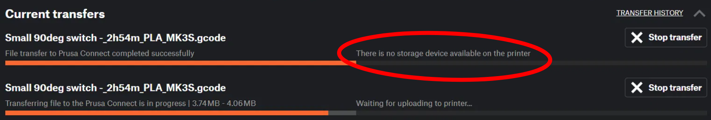

## **I wanted to describe a situation I encountered and how I resolved it**



# Multi-instance PrusaLink on one Raspberry Pi + "No storage device available" error in Prusa Connect/EasyPrint

**Setup:** Raspberry Pi 3, two MK3S printers, each handled by a separate PrusaLink instance (separate `.ini` file, separate systemd service, separate TCP port, separate `/dev/serial/by-id/...`).

## Symptom

Everything worked fine locally:
- controlling temperature, speed etc. from the PrusaLink dashboard — OK
- uploading and starting prints directly via `http://<ip>:PORT` (local PrusaLink interface) — OK
- connecting the printer in PrusaSlicer via local IP:PORT and sending prints that way — OK

But:
- **Prusa Connect** returned this on print attempts: *"There is no storage device available on the printer"*
- **EasyPrint from Printables** (which also goes through Connect) — same error

Additionally, PrusaLink's log (`journalctl -u prusalink -f`, with logging bumped up to catch it) showed serial communication errors during printer polling:
```
RuntimeError: Printer responded with something unexpected   (on M220)
RuntimeError: There are no matches for M27 P. That is weird.   (on M27)
```

## Red herrings I ruled out along the way

- resetting the SD card in the printer (removing/reinserting, full power cycle) — no effect
- reconnecting the printer from Prusa Connect (unlink/link) — no effect
- checking Pi power supply (`vcgencmd get_throttled` returned `0x50000` — undervoltage, but historical, from boot; voltage was normal at the time of testing) — a dead end unrelated to this specific error
- CPU/RAM load — Pi 3 was running normally at the time of the test

## Actual root cause

In both PrusaLink instances' `.ini` files, under `[printer]`, we had set a **custom, non-default path** for the gcode directory, e.g.:

```ini
[printer]
directory = /home/user/prusalink1/gcodes
```

instead of leaving the default (`./PrusaLink gcodes`, relative to the working directory).

**This breaks the Prusa Connect integration.** Local uploads still work fine (PrusaLink manages those files itself), but Connect's API side apparently hard-expects the default, standard folder name — with a custom path it reports no storage available, even though everything is physically fine.

Confirmed by someone else hitting the same symptom (Docker/K3S setup, but identical mechanism): https://github.com/prusa3d/Prusa-Link/issues/1012

## Fix

1. Stop the PrusaLink service for that printer.
```
sudo systemctl stop prusalink
```
3. Move the contents of your custom gcode directory into a folder with **exactly the default name** `PrusaLink gcodes` (with the space), inside that instance's working/data directory.
4. Remove (or comment out) the `directory = ...` line under `[printer]` in the `.ini` file so PrusaLink falls back to the default.
5. Start the service again.

With multi-instance setups (several printers on one Pi), separation still works correctly — since each instance has its own `data_dir`/working directory, the default relative path `./PrusaLink gcodes` still points to a separate folder per printer. You don't need a custom path for that — a separate working directory per instance is enough.

After this change, Connect and EasyPrint started working normally.
